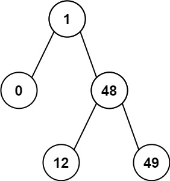

# 四月刷题
## [179. 最大数](Test1.java)

给定一组非负整数 nums，重新排列每个数的顺序（每个数不可拆分）使之组成一个最大的整数。

注意：输出结果可能非常大，所以你需要返回一个字符串而不是整数。


示例 1：
```
输入：nums = [10,2]
输出："210"
```
示例 2：
```
输入：nums = [3,30,34,5,9]
输出："9534330"
```
示例 3：
```
输入：nums = [1]
输出："1"
```
示例 4：
```
输入：nums = [10]
输出："10"
```

提示：
```
1 <= nums.length <= 100
0 <= nums[i] <= 10^9
```
<hr>

[783. 二叉搜索树节点最小距离](Test2.java)

给你一个二叉搜索树的根节点 root ，返回 树中任意两不同节点值之间的最小差值 。

[注意：](https://leetcode-cn.com/problems/minimum-absolute-difference-in-bst/)

`本题与 530：[https://leetcode-cn.com/problems/minimum-absolute-difference-in-bst/]相同
`

示例 1：


输入：root = [4,2,6,1,3]
输出：1

示例 2：


输入：root = [1,0,48,null,null,12,49]
输出：1


提示：

树中节点数目在范围 [2, 100] 内
0 <= Node.val <= 105